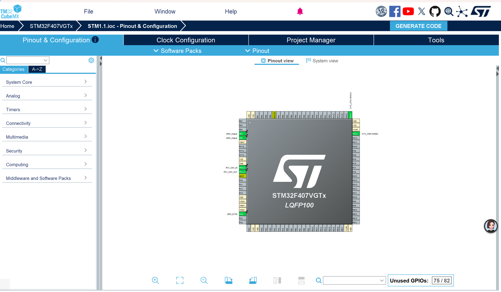
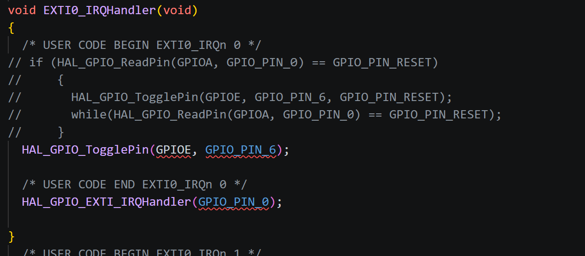
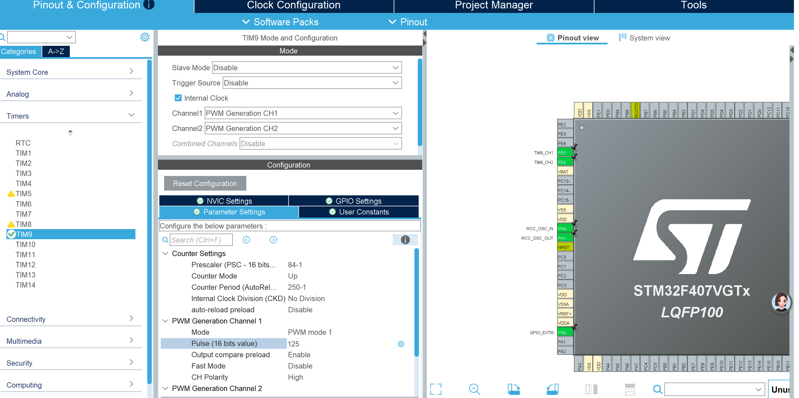

# 作业日志 (LOG)

## 2026_9_22 (填入今天的日期)
**任务内容：** 
1.修正了之前忘记配置板子的问题。
2.重新初始化了 Git 仓库并覆盖提交到 GitHub。
3.由于第二次作业是直接在第一次作业的基础上修改，并未保存第一次作业，故无法提交第一次作业的截图
4.编译成功时也忘记截图了，故展示修改过的代码
5.编译成功时，板子上红灯亮两秒暗两秒，绿灯一直不亮，知道按下控制按钮，松开按钮后灯灭

**任务截图：**

## 2026_9_24
**任务截图：**

